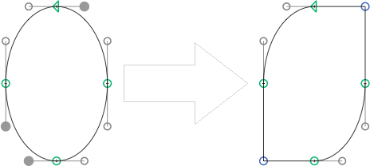

# MakeCorner.glyphsFilter

This is a plugin for the [Glyphs font editor](http://glyphsapp.com/) by Georg Seifert. It reverses the functionality of the *Round Corner* filter, and turns curve segments into corners again.

After installation, it will add the menu item *Filter > Make Corner* (de: *Ecke herstellen*). You can set a keyboard shortcut in System Preferences.

### Installation

1. *Window > Plugin Manager.*
2. Click the *Install* button next to the *Make Corner* entry.
3. Restart Glyphs.

### Usage Instructions

1. Select any number of off-curve nodes in the active glyphs.
2. Use *Filter > Make Corner* to turn the respective curve segments into corners. If you run it with multiple glyphs selected, it will turn all curved segments into corners.

### Custom Parameter

Although I am not sure if it makes sense to anyone, you can trigger the filter functionality via a custom parameter:

    Property: Filter
    Value: MakeCorner;

At the end of the parameter value, you can hang `exclude:` or `include:`, followed by a comma-separated list of glyph names. This will apply the filter only to the included glyphs, or the glyphs not excluded, respectively.

### Requirements

The plugin needs Glyphs 2.4 or higher. I assume it will not work in previous versions.

### License

Copyright 2014-2018 Rainer Erich Scheichelbauer (@mekkablue).
Based on sample code by Georg Seifert (@schriftgestalt) and Jan Gerner (@yanone).

Licensed under the Apache License, Version 2.0 (the "License");
you may not use this file except in compliance with the License.
You may obtain a copy of the License at

http://www.apache.org/licenses/LICENSE-2.0

See the License file included in this repository for further details.
