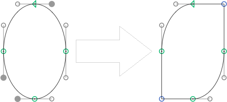

# MakeCorner.glyphsFilter

This is a plugin for the [Glyphs font editor](http://glyphsapp.com/) by Georg Seifert.
It reverses the functionality of the Round Corner filter, and turns curves into corners again.

After installation, it will add the menu item *Filter > Make Corner*.
You can set a keyboard shortcut in System Preferences.

### Installation

1. Download the complete ZIP file and unpack it, or clone the repository.
2. Double click the .glyphsFilter file. Confirm the dialog that appears in Glyphs.
3. Restart Glyphs

### Usage Instructions

1. Select any number of off-curve nodes in the active glyphs.
2. Use *Filter > Make Corner* to turn the respective curve segments into corners. If you run it with multiple glyphs selected, it will turn all curved segments into corners.

### Custom Parameter

Although I am not sure if it makes sense to anyone, you can trigger the filter functionality via a custom parameter:

    Property: Filter
    Value: GlyphsFilterMakeCorner;

### System Requirements

This plugin needs Glyphs 1.4.3 or later, running on OS X 10.7 or later. It has only been tested on OS X 10.9.2, though.

### License

Copyright 2014 Rainer Erich Scheichelbauer (@mekkablue).
Based on sample code by Georg Seifert (@schriftgestalt).

Licensed under the Apache License, Version 2.0 (the "License");
you may not use this file except in compliance with the License.
You may obtain a copy of the License at

http://www.apache.org/licenses/LICENSE-2.0

See the License file included in this repository for further details.
